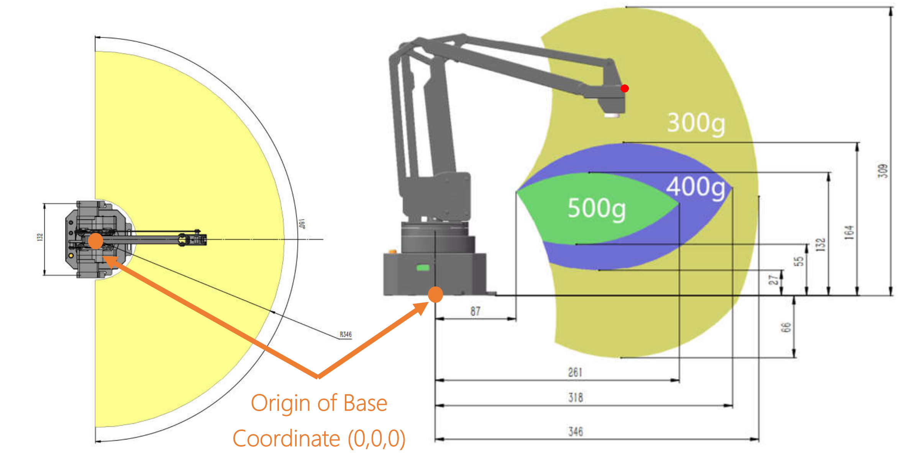

# Quirks

Below is a running list of hardware, firmware, software, and usability issues that I run into while using the uArm Swift Pro.

- [When Powering](#when-powering)
- [When Connecting](#when-connecting)
- [Overheating](#overheating)
- [Positions and Encoders](#positions-and-encoders)
- [Reachable Coordinates](#reachable-coordinates)
- [Arched Movements](#arched-movements)
- [Occasional Pauses](#occasional-pauses)
- [Camera Mounting](#camera-mounting)

## When Powering

When you power the device on, it will lock all it's motors, making it so none of the axes can move anymore.

It will also make a loud CLICK sound (which is the motors locking), and a very annoying BEEP can be heard.

## When Connecting

When you connect to the uArm's serial port through any software on your computer, the uArm will reset as if you have just powered it OFF then ON. It's behavior can be described as being the same as when powering on, except one very big difference: **all the motors will temporarily turn off**.

This means that all the motors will suddenly stop holding their position, and if the uArm might drop it's arm down if a motor was holding it up.

This can cause big problems during development, because the uArm is holding a position when you reconnect to it's port, then it will **suddenly drop** and potentially break something.

There are two ways to get around this problem:

1. When reconnecting to the serial port, hold the uArm with one hand so it does not drop
2. (preferred option) Use the `robot.home()` `robot.sleep()` methods whenever possible, which will automatically place your robot in a safe position, where if the motors turn off it will not fall. You can even use Python's `atexit` module to make sure the robot goes to a safe position before quitting.

```python
import atexit
from uarm import uarm_scan_and_connect
robot = uarm_scan_and_connect()
atexit.register(robot.sleep)
exit() # this will automatically call robot.sleep()
```

## Overheating

If a stepper motor is kept on for too long, it might overheat and cause issues on the uArm. The base motor on the uArm seems to be especially susceptible to overheating, cause the uArm to reset over and over or not be able to be connected to.

To prevent overheating, you can disable the base motor:

```python
robot.disable_base_motor()
```

Or, you can disable all the motors, but make sure it is in a safe position first:

```python
robot.home()
robot.disable_all_motors()
```

You can alernatively just run `robot.sleep()`, which will both home and disable motors for you.


## Positions and Encoders

The uArm Swift Pro comes with encoders on each of its 3 stepper motors' axes. This allows the device to track its position when the motors are disabled and you move it around by hand (cool!).

**However**, if you tell the uArm to move too quickly and it accidentally "skips steps" (meaning the motors makes a loud noise instead of moving like it should), the uArm does not have a way to both recover from this nor can it even detect that this has happened. Below is a quote from their support forums:

>[uArm Swift Pro] has the 12bit magnetic absolutely encoders in each joint, while now it works only after power on to detect the original position of each joint, it won't work during the movement.

So, if you ever skip steps while moving the robot, you will need to reset the uArm by either powering it OFF/ON or simply reconnecting to the serial port.

## Reachable Coordinates

Because of how it's constructed, the uArm Swift Pro has an unintuitive coordinate system and range. See the image below which does a good job showing it's limitations.



Because it can be unpredictable as to when the uArm is able to reach a coordinate or not, you can ask the uArm itself if a coordinate can be reached:

```python
if not robot.can_move_to(x=50, y=0, z=0):
    print('Can NOT move there')
if robot.can_move_to(x=150, y=0, z=0):
    print('Can move there')
```
If you do, however, ask the robot to move to a coordinate that it cannot move to, it will simply just ignore you and not move at all!
```python
if not robot.can_move_to(x=50, y=0, z=0):
    robot.move_to(x=50, y=0, z=0) # the uArm will ignore this and not move
```
This Python wrapper does not automatically check if a coordinate can be reached every time a move command is called, because that would slow down the robot a bit since we need to wait until the previous movement has finished. However, you can include this check by adding a `check=True` to a move command:
```python
try:
    robot.move_to(x=50, y=0, z=0, check=True)
except RuntimeError as e:
    print(e) # Coordinate not reachable by uArm: {'x': 50, 'y': 0, 'z': 0}

robot.move_to(x=150, y=0, z=0, check=True) # this should be OK
```

## Arched Movements

While moving from one coordinate to another, the uArm does not take a straight path. This is because of its construction and how the firmware controls each axis. Instead of moving straight their, it will take a bit of an arch to each position, most notably taking long motions across the Y axis (which moves the base motor the most).

## Occasional Pauses

This might just be a bug with my unit, but I've notice very occasional pauses, where the uArm just freezes for 3-5 seconds, and then carries on fine afterwards. TBD on what is causing this, not sure if it's a firmware issue, or a communication issue between the device and the Python SDK.

## Camera Mounting

The uArm Swift Pro can have an OpenMV camera mounted to it, presumably for use in detecting the location of object to pick up. **However**, the mount for this camera is not very sturdy, and the camera can move around between uses or have it's angle changed a bit.

While this might not seem like a big deal at first, it can be crucial when being used to detect the location of things in real-world space.

Therefore, try to attach the camera in a way such that it does not move at all, try not to bump the camera up against anything, and include in your project a method for quickly calibrating any small changes in camera location between uses.
